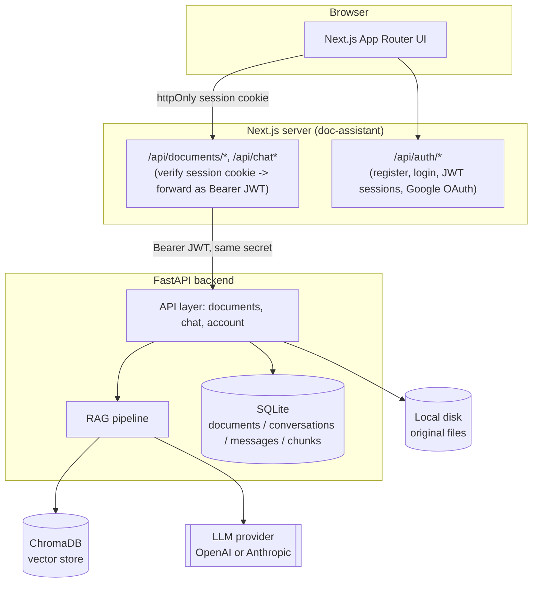
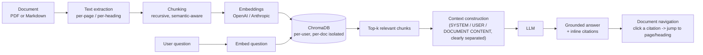

# Docent — Context-Aware AI Document Assistant

Upload a PDF or Markdown file. Ask it questions. Get answers grounded only
in that document, with a citation you can click to jump straight to the
source page or section.

**Upload → Retrieve → Ask → Cite.**

This is a 7-day portfolio build: a real Next.js + FastAPI application with
working authentication, a real RAG pipeline (LangChain + ChromaDB), streaming
chat, and Docker-based deployment — not a mock or a ChatGPT wrapper.

## Problem statement

Pasting a long PDF into a generic chatbot loses page numbers, mixes in the
model's outside knowledge, and gives no way to verify an answer against the
source. Docent is scoped narrowly on purpose: every answer is retrieved from
*your* uploaded document, cited inline, and clickable back to the exact page
or heading it came from. If the document doesn't contain the answer, it says
so instead of guessing.

## Features

- Email/password auth (bcrypt + JWT sessions) and Google OAuth
- Drag-and-drop upload for PDF and Markdown, with progress/cancel/retry
- Real document processing: text extraction → chunking → embeddings →
  ChromaDB storage, with a document never marked "Ready" until it actually is
- A document viewer (real PDF rendering with zoom/search/fullscreen/page-jump,
  or sanitized Markdown) split-screen with chat, tabbed on mobile
- Retrieval-augmented chat with inline `[Page 12]` citations, a sources
  panel, and **streaming** answers (SSE)
- Persistent, searchable, renameable conversation history, with
  auto-generated titles
- Document rename/download/delete (with full cascade cleanup)
- A settings page: profile, theme, security (change password, logout
  everywhere), and a storage dashboard
- Prompt-injection–resistant retrieval prompt (document content is always
  treated as untrusted data, never as instructions)
- Dockerized: `docker-compose up` runs the frontend, backend, and a
  standalone ChromaDB service together

## Architecture



The browser **never** talks to FastAPI directly. Every document/chat request
is proxied server-side by a Next.js route handler, which re-verifies the
signed-in user's session cookie and forwards it as a Bearer token — so
`API_BASE_URL` and every provider API key stay off the client entirely, and
the backend independently verifies each request rather than trusting
Next.js blindly. See `doc-assistant/src/lib/backend-proxy.ts`.

## RAG workflow



Every chunk carries its page number (PDF) or nearest heading (Markdown) as
metadata, so a citation is never a guess — it's the literal source of that
sentence. If retrieval returns nothing relevant, the backend skips the LLM
call and returns "the document doesn't contain enough information" directly,
so an empty result can't be quietly hallucinated over. See
`backend/app/rag/retrieval.py` for the full anti-hallucination system prompt.

## Technology stack

| Layer | Technology |
|---|---|
| Frontend | Next.js 16 (App Router), React 19, TypeScript, Tailwind |
| PDF rendering | react-pdf (pdf.js) |
| Markdown rendering | react-markdown + rehype-sanitize (XSS-safe) |
| Backend | Python, FastAPI |
| RAG orchestration | LangChain (chunking) |
| Vector store | ChromaDB |
| Embeddings / LLM | OpenAI (default) or Anthropic — swappable, see below |
| Metadata storage | SQLite |
| Auth | JWT sessions (jose), bcrypt, Google OAuth |
| Containerization | Docker, docker-compose |

## Project structure

```
.
├── doc-assistant/         Next.js frontend
│   ├── src/app/            routes: landing, auth, dashboard, API proxy routes
│   ├── src/components/     ui/, dashboard/, documents/, landing/, auth/
│   ├── src/lib/             auth/, backend-proxy.ts, documents-client.ts
│   └── README.md            frontend-specific notes
├── backend/                FastAPI RAG backend
│   ├── app/
│   │   ├── api/              documents, chat, account routers
│   │   ├── core/              config, JWT verification, middleware
│   │   ├── models/            SQLite access, Pydantic schemas
│   │   ├── rag/                loaders, chunking, embeddings, llm, vectorstore,
│   │   │                       pipeline, retrieval, suggestions
│   │   └── services/           storage, document_service
│   └── README.md            backend architecture notes
├── docker-compose.yml      frontend + backend + chroma, wired together
├── .env.example             root env template (used by docker-compose)
└── INSTALL.md               step-by-step local (non-Docker) setup
```

## Installation

See **[INSTALL.md](./INSTALL.md)** for full step-by-step instructions
(prerequisites, generating a shared session secret, troubleshooting). Short
version:

```bash
# Backend
cd backend && python3 -m venv .venv && source .venv/bin/activate
pip install -r requirements.txt
cp .env.example .env   # fill in SESSION_SECRET + OPENAI_API_KEY
uvicorn app.main:app --reload --port 8000

# Frontend (new terminal)
cd doc-assistant && npm install
cp .env.example .env.local   # same SESSION_SECRET as above
npm run dev
```

Open http://localhost:3000, register, and upload a document.

## Environment variables

Full templates: `doc-assistant/.env.example`, `backend/.env.example`, and
root `.env.example` (for Docker). The essentials:

| Variable | Where | Purpose |
|---|---|---|
| `SESSION_SECRET` | both | Signs/verifies the session JWT — **must match** in both services |
| `API_BASE_URL` | frontend | Where the Next.js proxy sends backend requests |
| `OPENAI_API_KEY` / `ANTHROPIC_API_KEY` | backend | LLM + embedding provider credentials |
| `LLM_PROVIDER` / `EMBEDDING_PROVIDER` | backend | `openai` or `anthropic` (embeddings: `openai` today) |
| `GOOGLE_CLIENT_ID` / `GOOGLE_CLIENT_SECRET` | frontend | Optional — enables "Sign in with Google" |
| `CHROMA_HOST` / `CHROMA_PORT` | backend | Set only when running Chroma as its own service (Docker) |
| `MAX_FILE_SIZE_MB` | both | Upload size limit — keep frontend/backend in sync |

## Running locally

Two ways: directly with `npm run dev` + `uvicorn` (see above / INSTALL.md),
or with Docker.

## Docker setup

```bash
cp .env.example .env   # fill in SESSION_SECRET, OPENAI_API_KEY, etc.
docker compose up --build
```

This starts three services: `frontend` (:3000), `backend` (:8000), and
`chroma` (:8001, a standalone ChromaDB server — the backend switches from
its embedded on-disk client to `HttpClient` automatically when `CHROMA_HOST`
is set, see `backend/app/rag/vectorstore.py`). Data persists in three named
volumes (`frontend_data`, `backend_data`, `chroma_data`) across restarts.

## API endpoints

Interactive docs (Swagger UI) are auto-generated at `http://localhost:8000/docs`
once the backend is running. Summary:

| Method | Path | Purpose |
|---|---|---|
| POST | `/api/documents/upload` | Upload a PDF/Markdown file |
| GET | `/api/documents` | List the caller's documents |
| GET | `/api/documents/{id}` | Get one document |
| PATCH | `/api/documents/{id}` | Rename a document |
| DELETE | `/api/documents/{id}` | Delete (cascades: files, vectors, chunks, conversations) |
| GET | `/api/documents/{id}/file` | Fetch the original file (`?download=true` for attachment) |
| GET | `/api/documents/{id}/suggested-questions` | Document-grounded starter questions |
| POST | `/api/chat` | Ask a question (non-streaming) |
| POST | `/api/chat/stream` | Ask a question (SSE: `start`/`delta`/`done`/`error`) |
| GET / DELETE / PATCH | `/api/chat/conversations/{id}` | Read, delete, or rename one conversation |
| GET | `/api/conversations?search=` | Cross-document conversation list, searchable |
| GET | `/api/account/summary` | Document/conversation counts and storage used |
| GET | `/health` | Service health (DB, vector store, LLM config) |

All routes except `/health` require a Bearer session token (in this app,
supplied automatically by the Next.js proxy layer — see Architecture above).

## Security considerations

- **Per-user isolation**: every document, conversation, and vector query is
  filtered by `user_id` at the database *and* ChromaDB layer — a user can
  never retrieve another user's chunks, even by guessing a document ID.
- **No direct backend access**: the browser only ever talks to Next.js;
  FastAPI is verified independently via a shared-secret JWT, not a trust
  relationship (see Architecture above).
- **Prompt injection**: retrieved document content is explicitly labeled as
  untrusted data in the LLM prompt (`SYSTEM INSTRUCTIONS` / `USER QUESTION` /
  `RETRIEVED DOCUMENT CONTENT`), with an explicit instruction never to treat
  document text as commands. See `backend/app/rag/retrieval.py`.
- **Uploads**: validated by extension and streamed to disk with a hard size
  cap enforced *during* the stream (not trusted from `Content-Length`);
  filenames are sanitized and stripped of path components before ever
  touching a filesystem path or HTTP header.
- **Markdown rendering**: sanitized (`rehype-sanitize`) before rendering —
  no raw HTML/script injection from an uploaded file.
- **Error handling**: a global exception handler ensures stack traces,
  file paths, and API keys are never returned to the client — only a
  request ID for correlating with server logs.
- **Rate limiting**: a basic in-memory limiter is included as scaffolding
  (429 + `Retry-After`); it is explicitly *not* production-grade (no
  cross-instance coordination) — see the comment in
  `backend/app/core/middleware.py` for the documented upgrade path.

## Screenshots

_Add screenshots here before publishing — e.g. the documents grid, the
split-screen viewer with an inline citation, and the settings storage
dashboard._

## Future improvements

- OCR for scanned/image-only PDFs
- A production-grade (Redis-backed, multi-instance) rate limiter
- Automated tests (unit + integration) and CI
- Postgres instead of SQLite, and a managed vector DB (e.g. Pinecone) for
  multi-instance deployments — both are single-file swaps, see
  `backend/README.md`
- Real-time collaborative document annotations
