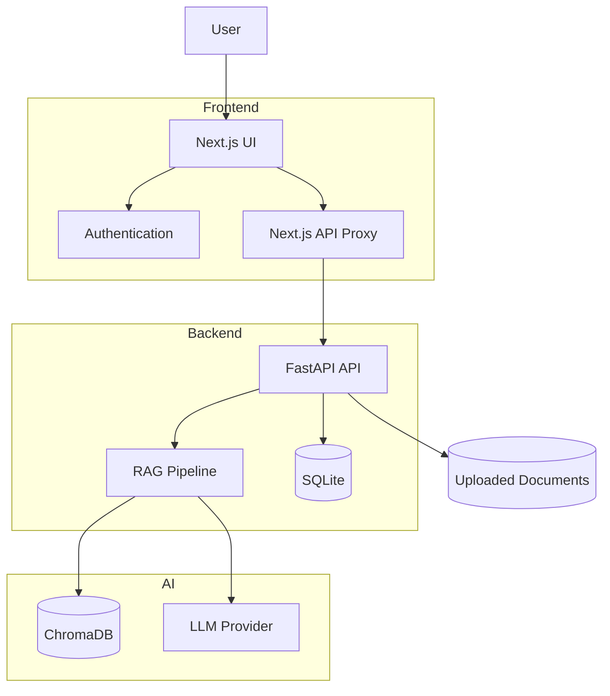
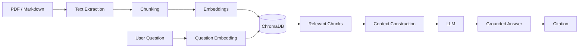
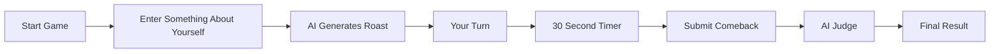
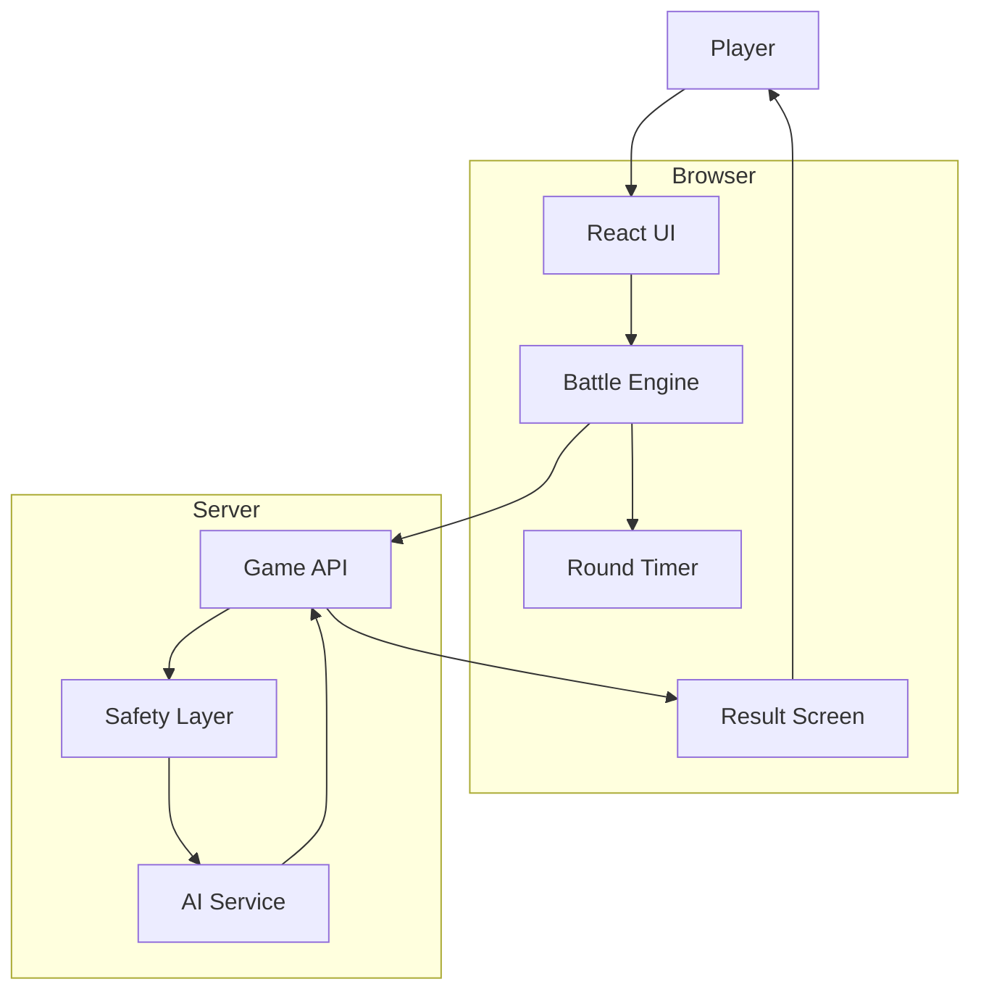
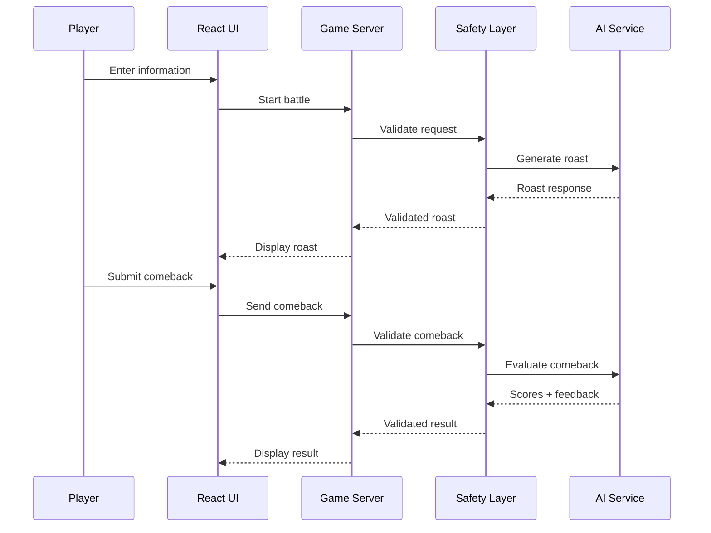
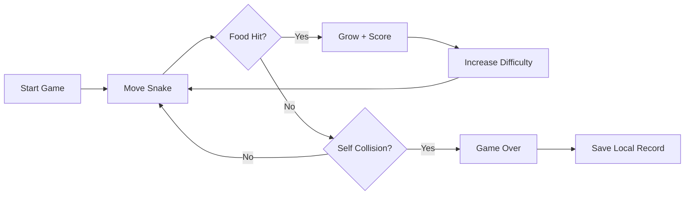
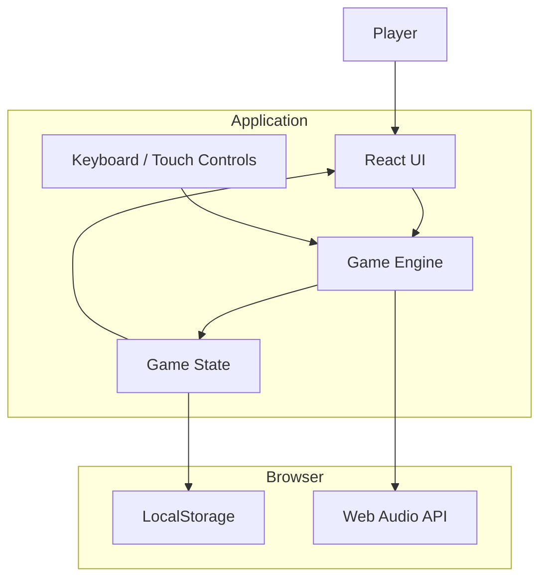

# Done Projects 


A collection of completed AI, software, and full-stack projects.

Each project contains its own documentation, architecture diagrams, setup instructions, and project files.

---

## Projects

| Project                                                                         | Description                                                                                                        | Status    |
| ------------------------------------------------------------------------------- | ------------------------------------------------------------------------------------------------------------------ | --------- |
| **[Context-Aware AI Document Assistant](#context-aware-ai-document-assistant)** | AI document assistant using RAG, citations, FastAPI and Next.js                                                    | Completed |
| **[AI Roast Battle](#ai-roast-battle)**                                         | Interactive AI-powered roast battle game                                                                           | Completed |
| **[OURO — Snake Game](#ouro--snake-game)**                                      | Responsive Snake game with progressive difficulty, local records, themes, skins, sound effects and mobile controls | Completed |
| **[✨ DataLens](#-datalens)**                                                   | Modern analytics dashboard for exploring datasets, visualizing trends, and creating shareable reports               | Completed |

---

# Context-Aware AI Document Assistant

> **Upload → Retrieve → Ask → Cite**

A context-aware AI document assistant that allows users to upload PDF or Markdown documents, ask questions about them, and receive answers grounded only in the uploaded document.

Answers include citations that allow users to navigate back to the relevant page or section.

## Problem Statement

Generic AI chatbots can:

* Lose document page references
* Mix outside knowledge with the uploaded document
* Provide answers that are difficult to verify
* Give answers that are not actually contained in the document

This project is designed to keep the AI focused on the uploaded document.

If the document does not contain enough information to answer a question, the system can respond accordingly instead of silently relying on unrelated information.

## Features

* PDF and Markdown document upload
* Document-grounded question answering
* Page and section citations
* Clickable citations
* Streaming AI responses
* Email/password authentication
* Google OAuth
* Retrieval-Augmented Generation (RAG)
* ChromaDB vector storage
* SQLite metadata storage
* Docker support
* Prompt-injection-aware retrieval
* Responsive document and chat interface
* Persistent conversation history
* Document management
* Storage dashboard

## Architecture



## RAG Workflow



## Technology Stack

| Layer            | Technology                           |
| ---------------- | ------------------------------------ |
| Frontend         | Next.js, React, TypeScript, Tailwind |
| Backend          | Python, FastAPI                      |
| RAG              | LangChain                            |
| Vector Database  | ChromaDB                             |
| Database         | SQLite                               |
| Authentication   | JWT, bcrypt, Google OAuth            |
| AI               | OpenAI / Anthropic                   |
| PDF Rendering    | react-pdf                            |
| Markdown         | react-markdown                       |
| Containerization | Docker                               |

## Project Structure

```text
context-aware-doc-assistant/
│
├── doc-assistant/
│   ├── src/
│   │   ├── app/
│   │   ├── components/
│   │   └── lib/
│   │
│   └── README.md
│
├── backend/
│   ├── app/
│   │   ├── api/
│   │   ├── core/
│   │   ├── models/
│   │   ├── rag/
│   │   └── services/
│   │
│   └── README.md
│
├── docker-compose.yml
├── .env.example
└── INSTALL.md
```

## Installation

See `INSTALL.md`.

### Backend

```bash
cd backend

python3 -m venv .venv

source .venv/bin/activate

pip install -r requirements.txt

cp .env.example .env

uvicorn app.main:app --reload --port 8000
```

### Frontend

Open another terminal:

```bash
cd doc-assistant

npm install

cp .env.example .env.local

npm run dev
```

Open:

```text
http://localhost:3000
```

## Docker

```bash
cp .env.example .env

docker compose up --build
```

The Docker setup runs the frontend, backend, and ChromaDB services.

## Security

The project includes:

* Per-user document isolation
* JWT authentication
* Server-side API proxy
* Prompt-injection-aware retrieval
* Upload size limits
* Filename sanitization
* Sanitized Markdown rendering
* Safe error handling
* Rate-limiting scaffolding

## Project Download

**Full Project**

[Download Context-Aware AI Document Assistant](./context-aware-doc-assistant-day1-7.zip)

[INSTALL.md](./INSTALL.md)

---

# AI Roast Battle

> **Can you roast the AI better than it can roast you?**

AI Roast Battle is an interactive browser game where the AI roasts the player and the player gets a limited amount of time to roast the AI back.

The AI then evaluates the player's comeback.

## How It Works



## Battle Flow

```text
START
  |
  v
Choose Battle
  |
  v
Give the AI something to roast
  |
  v
AI ROASTS YOU
  |
  v
Your Turn
  |
  v
30 Second Countdown
  |
  v
Write Your Comeback
  |
  v
AI JUDGES
  |
  +-- Creativity
  +-- Comedy
  +-- Damage
  |
  v
FINAL RESULT
```

## Features

* AI-generated roasts
* Timed comeback rounds
* Different heat levels
* Multiple game modes
* AI judging
* Round results
* Safety handling
* Game-focused interface
* Resilience and fallback handling

## Architecture



## Technology

```text
Frontend
    |
    v
React + TypeScript

Build
    |
    v
Vite

Backend
    |
    v
TypeScript Server

AI
    |
    v
Gemini-compatible AI integration

Styling
    |
    v
CSS

Development
    |
    v
Bun / npm
```

## Project Structure

```text
AI-Roast-Battle/
│
├── src/
│   ├── App.tsx
│   ├── main.tsx
│   ├── types.ts
│   │
│   ├── components/
│   │   ├── BattleScreen.tsx
│   │   ├── ChaosModeScreen.tsx
│   │   ├── DailyChallengeModal.tsx
│   │   ├── DeveloperModeScreen.tsx
│   │   ├── HowToPlayModal.tsx
│   │   ├── Navbar.tsx
│   │   ├── ResultScreen.tsx
│   │   └── StatsModal.tsx
│   │
│   └── utils/
│       └── audio.ts
│
├── server/
│   ├── auditEngine.ts
│   ├── db.ts
│   ├── fallbackRoasts.ts
│   ├── gemini.ts
│   ├── safety.ts
│   └── types.ts
│
├── index.html
├── package.json
├── server.ts
├── tsconfig.json
├── vite.config.ts
└── .env.example
```

## AI Battle Architecture



## Project Download

**Full Project**

[Download AI Roast Battle](./remix-ai-roast-battle.zip)

---

# OURO — Snake Game

> **Move → Grow → Survive → Beat Your Record**

OURO is a responsive browser-based Snake game built with React, TypeScript, and Vite.

The game combines classic Snake mechanics with progressive difficulty, local records, customizable themes and skins, sound effects, fullscreen support, and mobile controls.

**Live Demo:**
https://snake-seven-zeta.vercel.app/

**GitHub:**
https://github.com/Devputta/SNAKE---G

## Features

* Classic Snake gameplay
* Progressive speed and difficulty
* Snake self-collision detection
* Score and length tracking
* Local game records
* Light and dark themes
* Multiple snake and food skins
* Keyboard controls
* Mobile touch and swipe controls
* Web Audio sound effects
* Fullscreen mode
* Responsive interface

## Game Flow



## Architecture



## Technology Stack

| Layer      | Technology           |
| ---------- | -------------------- |
| Frontend   | React                |
| Language   | TypeScript           |
| Build Tool | Vite                 |
| Styling    | Tailwind CSS         |
| Icons      | Lucide React         |
| Animation  | Motion               |
| Audio      | Web Audio API        |
| Storage    | Browser LocalStorage |
| Deployment | Vercel               |

## Controls

| Action          | Control              |
| --------------- | -------------------- |
| Move            | Arrow Keys / W A S D |
| Pause / Menu    | P / Space            |
| Restart         | R                    |
| Fullscreen      | F                    |
| Close Menu      | Esc                  |
| Mobile Movement | Touch / Swipe        |

## Project Structure

```text
OURO-Snake/
│
├── src/
│   ├── components/
│   ├── levels/
│   ├── utils/
│   └── ...
│
├── public/
├── index.html
├── package.json
├── tsconfig.json
├── vite.config.ts
├── metadata.json
├── .env.example
└── README.md
```

## Installation

```bash
git clone https://github.com/Devputta/SNAKE---G.git

cd SNAKE---G

npm install

npm run dev
```

Open:

```text
http://localhost:3000
```

Production build:

```bash
npm run build
```

## Data

Game records and preferences are stored locally using the browser's `localStorage`.

The game does not require user accounts or a server-side player profile.

## Project Links

**Live Demo:**
https://snake-seven-zeta.vercel.app/

**GitHub Repository:**
https://github.com/Devputta/SNAKE---G

---


# ✨ DataLens

> **Turn raw data into clear, interactive insights.**

**A modern analytics dashboard for exploring datasets, visualizing trends, and creating shareable reports.**

[](./LICENSE)
[](https://react.dev/)
[](https://www.typescriptlang.org/)
[](https://vite.dev/)

---

## Overview

DataLens is a browser-based analytics and data-visualization workspace. It provides an interactive dashboard for inspecting datasets, tracking key metrics, customizing charts, and exporting reports.

The app includes sample SaaS revenue data so the dashboard can be explored immediately, along with tools for loading data and working with dashboard views.

## Features

- **Interactive dashboard** — KPI cards and responsive charts generated from the active dataset.
- **Dataset exploration** — inspect records in a table and work with supported uploaded data.
- **Filtering** — search records and refine views with available filters.
- **Data quality profiling** — review dataset structure and data-quality insights.
- **Chart customization** — adjust chart presentation and manage the dashboard layout.
- **Saved dashboard snapshots** — save and restore named layout configurations in the browser.
- **Automated reports and exports** — create report outputs and export dashboard data or visuals using the available app tools.
- **Theme and currency settings** — customize the display.
- **Live demo data mode** — simulate incoming records to see dashboard metrics update.

> DataLens is an analytics and visualization interface, not a substitute for validating business-critical data or decisions.

## Preview

Add a screenshot or demo GIF here when available:

```text
docs/images/datalens-preview.png
```

## Tech Stack

- React 19
- TypeScript
- Vite
- Tailwind CSS
- Motion
- Lucide React
- XLSX
- jsPDF
- Gemini integration dependency for AI-backed functionality when configured

## Getting Started

### Requirements

- Node.js — current LTS release recommended
- npm

### 1. Get the project

```bash
git clone <YOUR_REPOSITORY_URL>
cd <YOUR_PROJECT_DIRECTORY>
```

Or download the project ZIP from the link below.

### 2. Install dependencies

```bash
npm install
```

### 3. Configure environment variables

Copy `.env.example` to `.env.local`.

**Windows Command Prompt:**

```cmd
copy .env.example .env.local
```

**PowerShell:**

```powershell
Copy-Item .env.example .env.local
```

**macOS / Linux:**

```bash
cp .env.example .env.local
```

Set `GEMINI_API_KEY` only if the AI-backed functionality requires it. Keep real credentials private and never commit `.env.local`.

### 4. Start the development server

```bash
npm run dev
```

Open the local URL printed by Vite in the terminal.

### 5. Production build

```bash
npm run build
```

Preview the production build:

```bash
npm run preview
```

Run the project checks:

```bash
npm run lint
```

## Deployment

DataLens is a Vite frontend and can be deployed to static hosting platforms such as Vercel, Netlify, or Cloudflare Pages.

Typical build settings:

| Setting | Value |
|---|---|
| Build command | `npm run build` |
| Output directory | `dist` |

If a feature requires a secret API key, do not expose the secret in a public client-side environment variable. Use a trusted server-side endpoint or secure hosting configuration.

## Data and Privacy

- Use sample or non-sensitive data while evaluating the app.
- Review the application's data-processing and hosting configuration before uploading confidential data.
- Browser storage may be used for saved dashboard snapshots.
- Never commit datasets, credentials, access tokens, or private exports to source control.

## Security

See the project's `SECURITY.md` for vulnerability reporting guidance.

## Project Download

**Full Project**

[📦 Download DataLens ZIP](./datalens.zip)

## Project Status

**Status:** ✅ Completed

DataLens was built as a practical analytics and visualization project focused on turning raw datasets into interactive, understandable dashboard insights.

---

# Repository Structure

```text
Done-Project-Zip-files/
│
├── README.md
├── INSTALL.md
│
├── context-aware-doc-assistant-day1-7.zip
├── remix-ai-roast-battle.zip
├── OURO-Snake.zip
├── datalens.zip
│
└── projects/
    │
    ├── context-aware-doc-assistant.md
    ├── ai-roast-battle.md
    └── ouro-snake.md
```

---

# About This Repository

This repository contains completed projects built for learning, experimentation, portfolio development, and open-source sharing.

The goal is to document not only the final project but also the architecture, technologies, development process, and setup required to run each project.

---

# Open Source

You are welcome to:

* Fork the repository
* Explore the projects
* Study the source code
* Run projects locally
* Modify the projects
* Improve the documentation
* Submit pull requests
* Use the projects for learning

---

# Projects

| Project                             | Documentation                                        | Download                                        |
| ----------------------------------- | ---------------------------------------------------- | ----------------------------------------------- |
| Context-Aware AI Document Assistant | [View Project](#context-aware-ai-document-assistant) | [ZIP](./context-aware-doc-assistant-day1-7.zip) |
| AI Roast Battle                     | [View Project](#ai-roast-battle)                     | [ZIP](./remix-ai-roast-battle.zip)              |
| OURO — Snake Game                   | [View Project](#ouro--snake-game)                    | [ZIP](./OURO-Snake.zip)                         |
| ✨ DataLens                         | [View Project](#-datalens)                          | [ZIP](./datalens.zip)                           |

---
