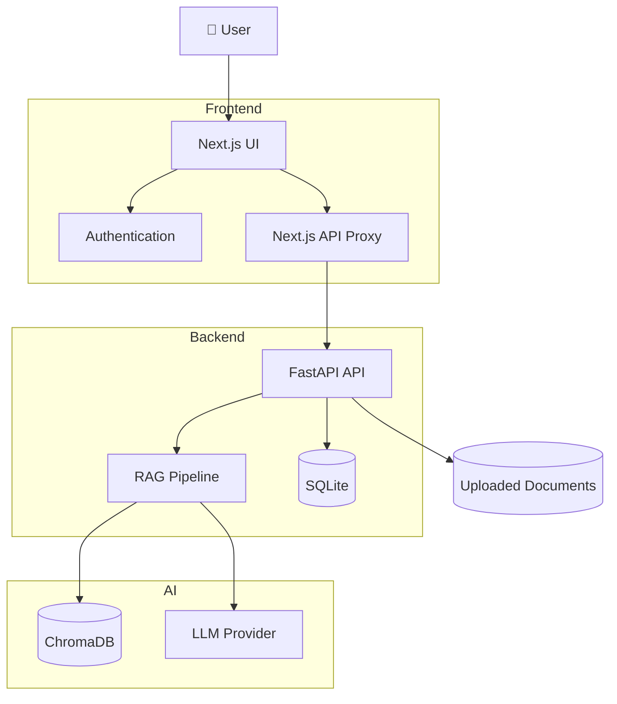
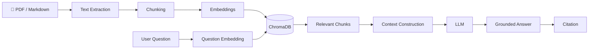
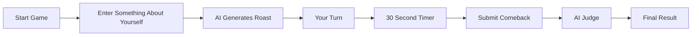
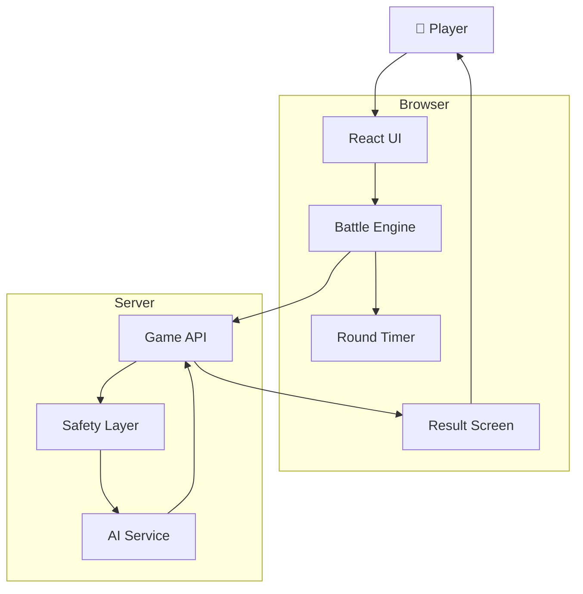
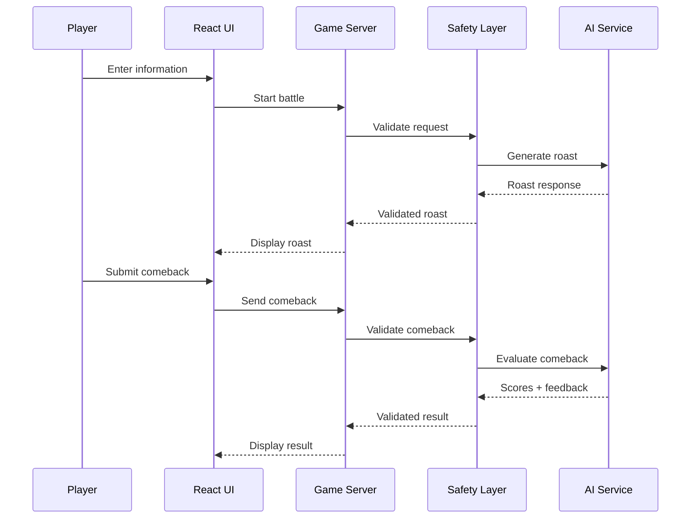

# 🚀 Done Projects

A collection of completed AI, software, and full-stack projects.

Each project contains its own documentation, architecture diagrams, setup instructions, and project files.

---

## 📚 Projects

| Project | Description | Status |
|---|---|---|
| 📄 **[Context-Aware AI Document Assistant](#-context-aware-ai-document-assistant)** | AI document assistant using RAG, citations, FastAPI and Next.js | ✅ Completed |
| 🔥 **[AI Roast Battle](#-ai-roast-battle)** | Interactive AI-powered roast battle game | ✅ Completed |

---

# 📄 Context-Aware AI Document Assistant

> **Upload → Retrieve → Ask → Cite**

A context-aware AI document assistant that allows users to upload PDF or Markdown documents, ask questions about them, and receive answers grounded only in the uploaded document.

Answers include citations that allow users to navigate back to the relevant page or section.

---

## 🎯 Problem Statement

Generic AI chatbots can:

- Lose document page references
- Mix outside knowledge with the uploaded document
- Provide answers that are difficult to verify
- Give answers that are not actually contained in the document

This project is designed to keep the AI focused on the uploaded document.

If the document does not contain enough information to answer a question, the system can respond accordingly instead of silently relying on unrelated information.

---

## ✨ Features

- 📄 PDF and Markdown document upload
- 🔍 Document-grounded question answering
- 📑 Page and section citations
- 🔗 Clickable citations
- 💬 Streaming AI responses
- 🔐 Email/password authentication
- 🔑 Google OAuth
- 🧠 Retrieval-Augmented Generation (RAG)
- 🗄️ ChromaDB vector storage
- 💾 SQLite metadata storage
- 🐳 Docker support
- 🛡️ Prompt-injection-aware retrieval
- 📱 Responsive document and chat interface
- 💬 Persistent conversation history
- ⚙️ Document management
- 📊 Storage dashboard

---

# 🏗️ Architecture



---

# 🔎 RAG Workflow



---

## 🛠️ Technology Stack

| Layer | Technology |
|---|---|
| Frontend | Next.js, React, TypeScript, Tailwind |
| Backend | Python, FastAPI |
| RAG | LangChain |
| Vector Database | ChromaDB |
| Database | SQLite |
| Authentication | JWT, bcrypt, Google OAuth |
| AI | OpenAI / Anthropic |
| PDF Rendering | react-pdf |
| Markdown | react-markdown |
| Containerization | Docker |

---

## 📁 Project Structure

```text
context-aware-doc-assistant/
│
├── doc-assistant/
│   ├── src/
│   │   ├── app/
│   │   ├── components/
│   │   └── lib/
│   │
│   └── README.md
│
├── backend/
│   ├── app/
│   │   ├── api/
│   │   ├── core/
│   │   ├── models/
│   │   ├── rag/
│   │   └── services/
│   │
│   └── README.md
│
├── docker-compose.yml
├── .env.example
└── INSTALL.md
```

---

## ⚙️ Installation

See:

👉 **[INSTALL.md](./INSTALL.md)**

Basic setup:

```bash
# Backend

cd backend

python3 -m venv .venv

source .venv/bin/activate

pip install -r requirements.txt

cp .env.example .env

uvicorn app.main:app --reload --port 8000
```

Then open another terminal:

```bash
# Frontend

cd doc-assistant

npm install

cp .env.example .env.local

npm run dev
```

Open:

```text
http://localhost:3000
```

---

## 🐳 Docker

```bash
cp .env.example .env

docker compose up --build
```

The Docker setup runs the frontend, backend, and ChromaDB services.

---

## 🔐 Security

The project includes:

- Per-user document isolation
- JWT authentication
- Server-side API proxy
- Prompt-injection-aware retrieval
- Upload size limits
- Filename sanitization
- Sanitized Markdown rendering
- Safe error handling
- Rate-limiting scaffolding

---

## 📦 Project Download

### Full Project

📥 **[Download Context-Aware AI Document Assistant](./context-aware-doc-assistant-day1-7.zip)**

### Installation Guide

📘 **[INSTALL.md](./INSTALL.md)**

---

# 🔥 AI Roast Battle

> **Can you roast the AI better than it can roast you?**

AI Roast Battle is an interactive browser game where the AI roasts the player and the player gets a limited amount of time to roast the AI back.

The AI then evaluates the player's comeback.

---

## 🎮 How It Works



---

# ⚔️ Battle Flow

```text
START
  │
  ▼
Choose Battle
  │
  ▼
Give the AI something to roast
  │
  ▼
AI ROASTS YOU
  │
  ▼
Your Turn
  │
  ▼
30 Second Countdown
  │
  ▼
Write Your Comeback
  │
  ▼
AI JUDGES
  │
  ├── Creativity
  ├── Comedy
  └── Damage
  │
  ▼
FINAL RESULT
```

---

## ✨ Features

- 🤖 AI-generated roasts
- ⏱️ Timed comeback rounds
- 🔥 Different heat levels
- 🎮 Multiple game modes
- 🧠 AI judging
- 📊 Round results
- 🛡️ Safety handling
- 🎨 Game-focused interface
- 🔄 Resilience/fallback handling

---

# 🏗️ Architecture



---

# 🧩 Technology

```text
Frontend
    ↓
React + TypeScript

Build
    ↓
Vite

Backend
    ↓
TypeScript Server

AI
    ↓
Gemini-compatible AI integration

Styling
    ↓
CSS

Development
    ↓
Bun / npm
```

---

## 📁 Project Structure

```text
AI-Roast-Battle/
│
├── src/
│   ├── App.tsx
│   ├── main.tsx
│   ├── types.ts
│   │
│   ├── components/
│   │   ├── BattleScreen.tsx
│   │   ├── ChaosModeScreen.tsx
│   │   ├── DailyChallengeModal.tsx
│   │   ├── DeveloperModeScreen.tsx
│   │   ├── HowToPlayModal.tsx
│   │   ├── Navbar.tsx
│   │   ├── ResultScreen.tsx
│   │   └── StatsModal.tsx
│   │
│   └── utils/
│       └── audio.ts
│
├── server/
│   ├── auditEngine.ts
│   ├── db.ts
│   ├── fallbackRoasts.ts
│   ├── gemini.ts
│   ├── safety.ts
│   └── types.ts
│
├── index.html
├── package.json
├── server.ts
├── tsconfig.json
├── vite.config.ts
└── .env.example
```

---

# 🔄 AI Battle Architecture



---

# 📦 Project Download

### Full Project

🔥 **[Download AI Roast Battle](./remix-ai-roast-battle.zip)**

---

# 📚 Repository Structure

```text
Done-Project-Zip-files/
│
├── README.md
├── INSTALL.md
│
├── context-aware-doc-assistant-day1-7.zip
├── remix-ai-roast-battle.zip
│
└── projects/
    │
    ├── context-aware-doc-assistant.md
    └── ai-roast-battle.md
```

---

# 🚀 About This Repository

This repository contains completed projects built for learning, experimentation, portfolio development, and open-source sharing.

The goal is to document not only the final project but also the architecture, technologies, development process, and setup required to run it.

---

# 🤝 Open Source

You are welcome to:

- Fork the repository
- Explore the projects
- Study the source code
- Run projects locally
- Modify the projects
- Improve the documentation
- Submit pull requests
- Use the projects for learning

If you find something useful, consider giving the repository a ⭐.

---

# 👨‍💻 Author

**Mahadevu M P**

GitHub:  
https://github.com/Devputta

---

## 📌 Projects

| Project | Documentation | Download |
|---|---|---|
| 📄 Context-Aware AI Document Assistant | [View Project](#-context-aware-ai-document-assistant) | [ZIP](./context-aware-doc-assistant-day1-7.zip) |
| 🔥 AI Roast Battle | [View Project](#-ai-roast-battle) | [ZIP](./remix-ai-roast-battle.zip) |

---

> **Build. Learn. Document. Share.**
